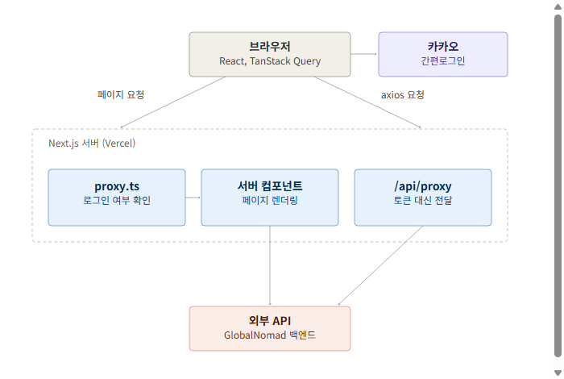

# 🗺 Nomadly

> **Forked from:** [GlobalNomad](https://github.com/Hanbh97/GlobalNomad)
>
> 팀 프로젝트 'GlobalNomad' 종료 후, 기술적 성장을 이어가고자 이를 포크했습니다.<br>
> 기존의 정체성은 유지하면서 고유한 명칭 '**Nomadly**'로 재배포했으며,<br>
> 리팩토링, 성능 최적화, 기능 확장을 진행하며 개선했습니다.

<br>
Nomadly는 일상 밖의 특별한 체험을 탐색하고 예약할 수 있는 플랫폼입니다.<br>
체험을 이용하는 게스트와 운영하는 호스트 모두를 지원합니다.
<br><br>

## 📍 목차

- [개요](#overview)
- [Fork 이후 개선 작업](#improvements)
- [주요 기능](#features)
- [기술 스택](#stack)
- [시스템 아키텍처](#architecture)
- [프로젝트 구조](#structure)
- [시작하기](#getting-started)
- [컨벤션](#convention)

---

<div id="overview"></div>

## 📋 개요

| 구분                    | 개발기간             | 내용                                                                                            |
| ----------------------- | -------------------- | ----------------------------------------------------------------------------------------------- |
| **원본 팀 프로젝트**    | 2026.05.26 ~ 06.24   | 6인 팀, 담당: 회원가입 페이지, 내 정보 페이지, 공통 컴포넌트(Button, Filter Button, AuthLayout) |
| **Fork 이후 개인 작업** | 2026.06.24 ~ 09.14   | 아래 [Fork 이후 개선 작업](#improvements) 참조                                                  |

[**Vercel 배포**](https://nomadly-imyoonsoo.vercel.app)

<br>

<div id="improvements"></div>

## 📈 Fork 이후 개선 작업

팀 프로젝트를 포크한 뒤 진행한 주요 개선 작업입니다.

### 성능 최적화와 웹 접근성 개선

CLS를 모바일 0.451, 데스크탑 0.413에서 **모두 0**으로 낮췄습니다. 배너와 카드에 스켈레톤 UI를 적용하고, 이미지 로딩과 번들 크기, 폰트 로딩을 최적화했습니다. 스크린 리더 안내와 접근성 속성도 추가했습니다.

### SEO와 메타데이터 정리

메인 체험 목록을 SSR로 전환하고 페이지별 메타데이터를 정리했습니다. 검색 노출과 화면별 탭 제목이 정확해졌습니다.

### UX 개선

체험 설명에 입력한 줄바꿈이 화면에 반영되지 않던 문제를 고쳐 가독성을 높였습니다.

|                                  적용 전                                   |                                  적용 후                                  |
| :------------------------------------------------------------------------: | :-----------------------------------------------------------------------: |
|  |  |

서비스 자체 뒤로가기 버튼과 인기 체험 캐러셀 이전 버튼을 추가했습니다. 예약 스케줄은 날짜 범위를 선택하면 시간대를 한 번에 등록하도록 개선했습니다.

### 로딩과 에러 처리를 Suspense로 통합

`isLoading`, `isError` 분기를 `Suspense`와 자체 `ErrorBoundary`로 전환했습니다. 마이페이지 5개 화면에 적용하고 로딩 스켈레톤을 새로 추가했습니다.

### 그 외

- **CI 파이프라인**: PR마다 lint, 프로덕션 빌드 자동 검증, Claude 인라인 코멘트 리뷰, 요약 Notion 기록
- **개발환경 정비**: `git blame` 제외 설정, `.gitattributes` LF 정규화, Tailwind 클래스 자동 정렬, spacing scale 통일
- **로그인 버그 수정**: 로그인 불가 문제 해결

전체 변경 이력은 [Pull Requests](https://github.com/imyoonsoo/nomadly/pulls?q=is%3Apr+is%3Amerged)에서 확인할 수 있습니다.

<br>

<div id="features"></div>

## ✨ 주요 기능

- **인증**: 회원가입, 로그인, 카카오 OAuth 소셜 로그인
- **체험 둘러보기**: 체험 목록 조회, 상세 페이지, 후기 확인
- **예약**: 날짜와 시간대별 예약 신청, 예약 가능 일정 조회
- **마이페이지**: 내 정보 관리, 내 예약 내역, 찜한 체험 목록
- **호스트 기능**: 체험 등록과 수정, 내 체험 관리, 예약 현황 관리
- **알림**: 예약 상태에 따른 실시간 알림 확인
- **추천과 게임**: MBTI, 밸런스, 경험 기반 추천, 룰렛, 미니게임(닷지, 지구 점프, 틱택토)
- **정책 페이지**: FAQ, 개인정보처리방침

<br>

<div id="stack"></div>

## 🔧 기술 스택

| Category           | Tech                    |
| ------------------ | ----------------------- |
| **Framework**      | Next.js 16 (App Router) |
| **Library**        | React 19                |
| **Language**       | TypeScript              |
| **Styling**        | Tailwind CSS v4         |
| **Server State**   | TanStack Query          |
| **HTTP Client**    | Axios                   |
| **Form**           | React Hook Form         |
| **Authentication** | Kakao OAuth             |
| **Maps**           | Kakao Maps              |
| **Notification**   | React Hot Toast         |
| **UI**             | Swiper                  |
| **Code Quality**   | ESLint, Prettier        |

<br>

<div id="architecture"></div>

## 🏗️ 시스템 아키텍처



<br>

<div id="structure"></div>

## 🗂️ 프로젝트 구조

```
src/
├── app/                  # Next.js App Router (라우트 그룹 기반)
│   ├── (auth)/           # 로그인, 회원가입
│   ├── (main)/           # 메인, 체험 목록/상세, 정책
│   ├── (mypage)/         # 마이페이지, 호스트 체험 관리
│   ├── api/proxy/        # API 프록시 라우트
│   ├── oauth/kakao/      # 카카오 OAuth 콜백
│   ├── recommendation/   # 추천 기능
│   └── game/             # 미니게임
├── features/             # 도메인별 기능 모듈
├── components/           # 공용 UI 컴포넌트(Button, Modal, Input, layout 등)
├── hooks/                # 전역 커스텀 훅
├── lib/                  # api, http, query, utils
├── constants/            # 상수(icons, images, policy 등)
├── types/                # 전역 타입 정의
└── proxy.ts              # 토큰 자동 재발급 프록시 로직
```

`features/`를 중심으로 도메인 단위로 분리한 **Feature-based 구조**를 적용했습니다.

<br>

<div id="getting-started"></div>

## 🚀 시작하기

```bash
npm install
npm run dev      # 개발 서버
npm run build    # 프로덕션 빌드
```

프로젝트 루트에 `.env.local`을 만들고 아래 값을 채워주세요.

```bash
NEXT_PUBLIC_API_BASE_URL=      # 백엔드 REST API 주소
NEXT_PUBLIC_SITE_URL=          # 배포 주소
NEXT_PUBLIC_KAKAO_MAP_KEY=     # 카카오 지도 JavaScript 키
NEXT_PUBLIC_KAKAO_REST_API_KEY=  # 카카오 OAuth REST API 키
NEXT_PUBLIC_KAKAO_REDIRECT_URI=  # 카카오 OAuth 리다이렉트 주소
```

클론 직후 아래 명령도 한 번 실행해주세요.

```bash
git config blame.ignoreRevsFile .git-blame-ignore-revs
```

Tailwind 클래스 자동 정렬처럼 전체 파일을 건드리는 대량 포맷팅 커밋을 `git blame`에서 건너뛰도록 설정합니다. 각 코드의 **실제 작성자와 변경 이력**이 포맷팅 커밋에 가려지지 않고 정확히 추적됩니다.

<br>

<div id="convention"></div>

## 🗞 컨벤션

프로젝트 컨벤션은 [`conventions/`](conventions) 폴더의 문서를 참고하세요.

- [git 규칙](conventions/git%20규칙.md)
- [디렉터리 구조](conventions/디렉터리%20구조.md)
- [네이밍 규칙](conventions/네이밍%20규칙.md)
- [코드 스타일](conventions/코드%20스타일.md)
